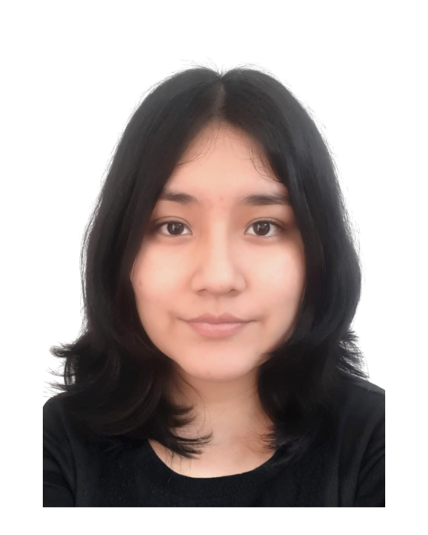
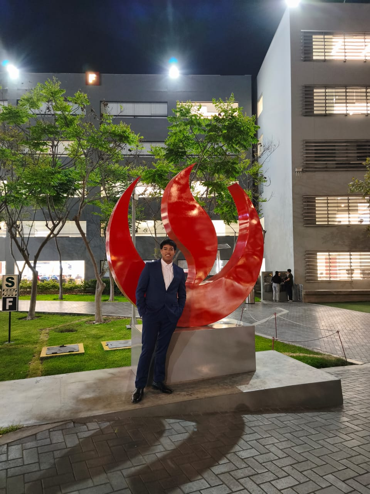

# CAPÍTULO I: INTRODUCCIÓN

## 1.1. Startup Profile

### 1.1.1. Descripción del Startup

### 1.1.2. Perfiles de integrantes del equipo

| Integrantes | Descripción |
| :--- | :--- |
|  | **Nombres y Apellidos:** Adrian Andres Armestar Felipa   **Código:** U202410084   **Carrera:** Ingenieria de Software   Soy una persona confiable, adaptable y responsable en cuanto a las entregas de los trabajos. Me especializo en el lenguaje C++ pero también tengo conocimientos acerca de base de datos y JavaScript. Poseo una mentalidad de mejora continua, donde busco aprender y mejorar mis habilidades. Del mismo modo, busco trabajar de manera constante y con una adecuada gestión del tiempo. |
| | **Nombres y Apellidos:** Santiago Armando Baldeón Vivar   **Código:**    **Carrera:** Ingenieria de Software   |
|   | **Nombres y Apellidos:** Katty Yolanda Philco Mota   **Código:** U202416107  **Carrera:** Ingeniería de Software  |
|  | **Nombres y Apellidos:** Rose Almendra Vergaray Calderon  **Código:** U20241D159  **Carrera:** Ingeniería de Software  Soy una persona responsable, creativa y detallista, cualidades que me impulsan a dar lo mejor de mí en cada proyecto. Cuento con conocimientos en Python, HTML, Java y un nivel intermedio en C++, además de experiencia en el diseño y programación de páginas web y en el manejo de bases de datos relacionales y no relacionales. Me motiva el aprendizaje constante, la exploración de nuevas herramientas y el desarrollo de soluciones innovadoras. Además, considero que el trabajo en equipo y la comunicación son esenciales para alcanzar metas y crecer tanto en lo personal como en lo profesional. |
|  | **Nombres y Apellidos:** Ethan Raul Yi Torrejon  **Código:** U202313434  **Carrera:** Ingeniería de Software  Soy una persona apasionada por el codigo y la logica de programacion mis lenguajes principales es c++ y python. A parte me gusta mucho todo lo que es la base de datos y manejo de Big Data utilizando Power BI y bases de datos relacional y no relacional o hibrido. |

## 1.1. Solution Profile

### 1.2.1. Antecedentes y problemática

### 1.2.2. Lean UX Process

#### 1.2.2.1. Lean UX Problem Statements

#### 1.2.2.2. Lean UX Assumptions

#### 1.2.2.3. Lean UX Hypothesis Statements

#### 1.2.2.4. Lean UX Canvas

## 1.3. Segmentos Objetivo
