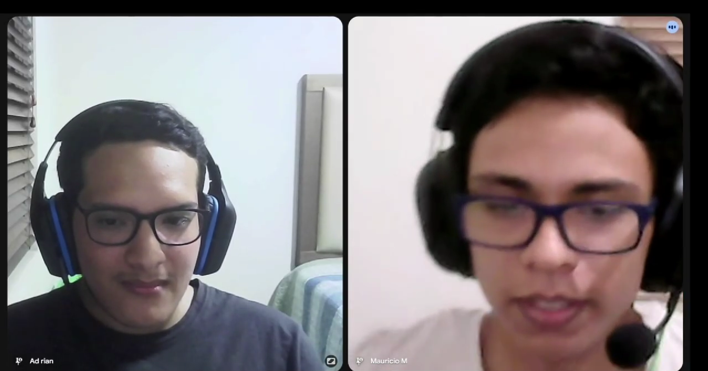

# CAPÍTULO II: REQUIREMENTS ELICITATION & ANALYSIS

## 2.1. Competidores

### 2.1.1. Análisis competitivo

### 2.1.2. Estrategias y tácticas frente a competidores

## 2.2. Entrevistas

### 2.2.1. Diseño de entrevistas

  **Primer Segmento:** A continuación, se presentan las preguntas dirigidas al segmento de empresas mineras, conformado por profesionales y organizaciones responsables de la extracción, transporte y gestión de minerales. Este segmento se encarga de la obtención y movilización de los recursos, enfrentando desafíos relacionados con el control y la trazabilidad.

  - **Preguntas principales:**
1.	¿Cómo registran actualmente el traslado de minerales?
2.	¿Existen problemas de pérdida o falta de control?
3.	¿Cuál es tu principal objetivo en la gestión de materiales o minerales?
4.	¿Qué herramientas usan para monitoreo?
5.	¿Qué tan común es la falta de trazabilidad?
6.	¿Qué impacto tiene en costos o producción?
7.	¿Crees útil un sistema que rastree minerales desde la extracción?
8.	¿Qué información sería clave para ustedes?
9.	¿Qué tan frecuente es la ocurrencia de fallas durante la obtención de minerales?
10.	¿Cómo identifican actualmente los errores o fallas en la extracción de minerales?

- **Preguntas complementarias**
1.	¿Cuál es tu edad?
2.	¿En qué distrito o zona vives?
3.	¿Cuál es tu estado civil?
4.	¿Qué dispositivos utilizas con mayor frecuencia en tu trabajo?
5.	¿Utilizas aplicaciones o sistemas digitales en tus labores diarias? ¿Cuáles?
6.	¿Qué rol desempeñas dentro del sector minero?
7.	¿Qué es lo que más te frustra del proceso actual de control o traslado de minerales?

 **Segundo Segmento:** A continuación, se presentan las preguntas dirigidas al segmento de joyerías, integrado por personas que trabajan en la fabricación y comercialización de productos elaborados con minerales. Estas empresas pueden operar tanto con materiales provenientes de proveedores como con insumos proporcionados directamente por los clientes.

  - **Preguntas principales:**
1.	¿Cómo verificas la autenticidad de las joyas que vendes?
2.	¿Has tenido problemas con proveedores o materiales falsos?
3.	¿Qué tan importante es para tus clientes saber el origen de una joya?
4.	¿Llevas algún registro del origen de tus productos?
5.	¿Tus clientes te piden certificación o pruebas de autenticidad?
6.	¿Cómo generas confianza al vender?
7.	¿Qué problemas has tenido con la trazabilidad o calidad del material?
8.	¿Has perdido ventas por falta de confianza del cliente?
9.	¿Qué haces cuando un cliente trae su propio material (oro u otros minerales)?
10.	¿Cómo manejas o comunicas la autenticidad cuando el material es proporcionado por el cliente?

- **Preguntas complementarias**
1.	¿Cuál es tu edad?
2.	¿En qué distrito o zona vives?
3.	¿Cuál es tu estado civil?
4.	¿Qué rol desempeñas dentro de la joyería?
5.	¿Usas sistemas digitales para gestionar ventas o inventario?
6.	¿Qué es lo más difícil al trabajar con materiales proporcionados por proveedores o clientes?

**Tercer Segmento:** A continuación, se presentan las preguntas dirigidas al segmento de usuarios consumidor, es decir, personas que adquieren productos fabricados con minerales, como joyas. Este segmento se caracteriza por su creciente interés en la autenticidad, la transparencia y el origen ético de los productos que consume.

  - **Preguntas principales:**
1.	¿Con qué frecuencia compras joyas?
2.	¿Qué factores consideras al comprar (precio, marca, material, etc.)?
3.	¿Te preocupa si una joya es auténtica?
4.	¿Cómo sabes si una joya es real?
5.	¿Te importa el origen del producto (si es ético o no)?
6.	¿Pagarías más por una joya certificada como ética?
7.	¿Qué tanta confianza tienes en la información que brindan las marcas sobre sus productos?
8.	¿Te gustaría poder verificar por ti mismo el origen de un producto mediante una app o código QR?
9.	¿Qué tipo de información te gustaría conocer antes de comprar una joya o producto mineral?
10.	 ¿Dejarías de comprar una marca si supieras que sus productos provienen de explotación laboral o prácticas poco éticas?

- **Preguntas complementarias**
1.	¿Cuál es tu edad?
2.	¿En qué distrito o zona vives?
3.	¿Cuál es tu estado civil?
4.	¿Qué dispositivos utilizas con mayor frecuencia (celular, laptop, etc.)?
5.	¿Qué opinas de productos con certificaciones como “cruelty-free” o “eco-friendly”?
6.	¿Qué buscas principalmente al comprar una joya o producto (ej. calidad, estatus, significado, inversión)?

### 2.2.2. Registro de entrevistas

| Segmento: Empresas Mineras | Entrevista #1 |
| --- | --- |
| Nombres y Apellidos | Efraín Zelaya |
| Edad | 42 años |
| Distrito | Huaura |
| Ocupación | Ingeniero metalurgista |
| Timming inicio | |
| Duración | 17 minutos y 08 segundos |
| URL | |
| Screenshot |  |
| Resumen |El entrevistado es un ingeniero metalurgista de 42 años residente en Huacho (Huaura), con 10 años de experiencia en el sector minero, el cual se desempeña en la planta concentradora, enfocado en la recuperación de metales valiosos. Utiliza principalmente el celular y aplicaciones como WhatsApp para reportes, debido a las limitaciones de conectividad en zonas mineras, lo que evidencia un uso restringido de herramientas digitales. Su objetivo principal es maximizar la recuperación de recursos valiosos mediante análisis químicos de laboratorio que permiten evaluar las leyes del mineral y asegurar la rentabilidad del proceso. Uno de los principales problemas identificados es la falta de trazabilidad, especialmente en la minería informal, donde se trabaja sin información precisa ni planificación, ello genera pérdidas económicas significativas y un alto índice de fracaso en proyectos. Además, menciona como frustración la excesiva carga burocrática del Estado, que dificulta la formalización y operación eficiente. Finalmente, considera que la implementación de sistemas digitales de rastreo sería altamente beneficiosa, ya que permitiría monitorear en tiempo real información clave como las leyes del mineral. Esto facilitaría una mejor toma de decisiones por parte de ingenieros, geólogos y mineros, reduciendo errores y optimizando los procesos productivos. |

| Segmento: Empresas Mineras | Entrevista #2 |
| --- | --- |
| Nombres y Apellidos | Max Alonso Yapo Figueroa|
| Edad | 31|
| Distrito | Arequipa (Cercado)|
| Ocupación | Ingeniero metalurgista |
| Timming inicio | |
| Duración | 6 minutos y 27 segundos|
| URL | |
| Screenshot | |
| Resumen | El entrevistado es un profesional de 31 años, residente en Arequipa, que se desempeña como jefe de metalurgia y operaciones. En su trabajo utiliza principalmente el celular y la laptop, además de herramientas especializadas como Molycop. Actualmente, el registro del traslado de minerales se realiza mediante plantillas de Excel, complementadas con personal encargado del seguimiento desde la mina hasta la planta. Sin embargo, este proceso presenta limitaciones, ya que el control es en gran parte empírico, lo que genera errores en el pesaje de los volquetes y en las balanzas. Estos errores, aunque inicialmente pequeños, se acumulan con el tiempo y generan cuellos de botella operativos, afectando la precisión de los datos. Si bien existe un monitoreo constante mediante personal distribuido en la ruta, la trazabilidad no siempre es completamente precisa. Respecto a las fallas, suelen ser de nivel leve a moderado y están relacionadas con factores operativos. Además, el registro de incidentes se realiza de forma manual (en papel), utilizando dispositivos digitales solo para comunicación, lo que limita la eficiencia del proceso. Finalmente, el entrevistado considera que la implementación de un sistema digital de rastreo desde la extracción sería altamente beneficiosa, destaca la importancia de contar con información precisa sobre la ubicación del mineral y el tonelaje exacto, ya que los errores en estos datos afectan directamente el control del concentrado y la toma de decisiones en la planta.|

| Segmento: Empresas Mineras | Entrevista #3 |
| --- | --- |
| Nombres y Apellidos | |
| Edad | |
| Distrito | |
| Ocupación | |
| Timming inicio | |
| Duración | |
| URL | |
| Screenshot | |
| Resumen | |

| Segmento: Joyerías | Entrevista #1 |
| --- | --- |
| Nombres y Apellidos | Yesiliany Canchica Muñoz |
| Edad | 21 años |
| Distrito | Surquillo |
| Ocupación | Secretaria de Joyería |
| Timming inicio | |
| Duración | 4 minutos y 50 segundos|
| URL | |
| Screenshot | |
| Resumen | La entrevistada es una joven de 21 años que reside en Surquillo, ella trabaja como secretaria en una joyería desempeñando funciones operativas dentro del negocio. La gestión de inventarios se realiza de manera manual, ellos no realizan digitalización para los procesos internos del negocio. Respecto al control de calidad, la empresa utiliza tanto métodos tradicionales como tecnológicos para verificar la autenticidad del oro, como la prueba del ácido nítrico y máquinas de medición de quilataje. Sin embargo, uno de los principales desafíos identificados es el trabajo con materiales proporcionados por los clientes, puesto que si el oro no posee la calidad adecuada, el proceso de refinamiento implica una merma significativa pudiendo perderse hasta 1.5 gramos por cada 5 gramos iniciales. Respecto a la trazabilidad, la joyería mantiene relaciones de confianza con proveedores desde hace más de 10 años lo que garantiza la autenticidad del material adquirido. Por otro lado, los clientes valoran altamente el origen de las joyas y suelen exigir certificaciones especialmente en piezas con piedras preciosas. Finalmente, ella menciona que la confianza del cliente se construye a través de la transparencia, informando sobre la calidad real de las piezas y sus posibles riesgos. En síntesis, se observa un entorno de trabajo tradicional, enfocado en la experiencia y la calidad con oportunidades de mejora en la incorporación de herramientas digitales para la gestión. |

| Segmento: Joyerías | Entrevista #2 |
| --- | --- |
| Nombres y Apellidos | |
| Edad | |
| Distrito | |
| Ocupación | |
| Timming inicio | |
| Duración | |
| URL | |
| Screenshot | |
| Resumen | |

| Segmento: Joyerías | Entrevista #3 |
| --- | --- |
| Nombres y Apellidos | |
| Edad | |
| Distrito | |
| Ocupación | |
| Timming inicio | |
| Duración | |
| URL | |
| Screenshot | |
| Resumen | |

| Segmento: Usuario consumidor | Entrevista #1 |
| --- | --- |
| Nombres y Apellidos | Carla Gallardo Morales |
| Edad | 19 años |
| Distrito | La Molina |
| Ocupación | Estudiante universitaria |
| Timming inicio | |
| Duración | 4 minutos y 44 segundos |
| URL | |
| Screenshot |  |
| Resumen | Carla Gallardo es una joven de 19 años que reside en La Molina, soltera y estudiante universitaria. Ella usa principalmente el celular y la computadora para sus actividades académicas, lo que evidencia un perfil digital activo. Su frecuencia de compra de joyas es baja, adquiriendo principalmente accesorios de acero y comprando oro o plata  cada tres años aproximadamente. Al comprar una joya, sus principales criterios son la autenticidad del material, el diseño, la marca y el precio, muestra una alta preocupación por la autenticidad, aunque reconoce tener poco conocimiento técnico, lo que genera desconfianza hacia mecanismos tradicionales como los sellos de quilataje, ya que pueden ser falsificados. Asimismo, ella también valora el origen ético de los productos, tiene una postura positiva hacia certificaciones como “cruelty-free” y afirma que estaría dispuesta a pagar más por una joya que garantice tanto autenticidad como condiciones laborales justas. Además, señala que dejaría de consumir una marca si descubre prácticas de explotación laboral. Antes de realizar una compra le gustaría tener información clara sobre la autenticidad del material, el precio y la procedencia del producto. Finalmente, considera que herramientas tecnológicas como la verificación mediante QR o aplicaciones serían una solución efectiva para aumentar la confianza del consumidor. |

| Segmento: Usuario consumidor | Entrevista #2 |
| --- | --- |
| Nombres y Apellidos | Mauricio Moquillaza |
| Edad | 19 años |
| Distrito | Jesús María |
| Ocupación | Estudiante|
| Timming inicio | |
| Duración |11 minutos y 35 segundos |
| URL | |
| Screenshot | |
| Resumen | El entrevistado es Mauricio Moquillaza, un joven de 19 años, residente en Jesús María, Lima, soltero. Utiliza con frecuencia el celular y la laptop, mostrando un perfil digital activo. Su frecuencia de compra de joyas es baja, aproximadamente una vez al año, priorizando productos duraderos y de larga vida útil. Al momento de comprar, se enfoca principalmente en la apariencia visual, la durabilidad y que el precio sea acorde al producto, restando importancia a la marca. Sin embargo, muestra una alta preocupación por la autenticidad, debido a la existencia de falsificaciones. Aunque posee conocimientos básicos de verificación (como pruebas caseras), su nivel de confianza en las marcas es bajo ya que considera que muchas utilizan el marketing como estrategia más que como garantía real. En cuanto al aspecto ético, considera importante el origen de las joyas, especialmente para evitar contribuir a la minería ilegal o explotación laboral. Afirma que estaría dispuesto a pagar un poco más por productos certificados y que dejaría de comprar una marca si se comprobara que incurre en prácticas poco éticas. Finalmente, destaca el valor de herramientas tecnológicas como aplicaciones o códigos QR para verificar la autenticidad y trazabilidad del producto. Le gustaría acceder a información clara sobre la pureza del material y su procedencia, lo que refleja una necesidad de mayor transparencia y confianza en el mercado de joyería. |

| Segmento: Usuario consumidor | Entrevista #3 |
| --- | --- |
| Nombres y Apellidos | Oliver Galindo |
| Edad | 20 años |
| Distrito | Comas |
| Ocupación | Estudiante |
| Timming inicio | |
| Duración | 09 minutos y 43 segundos|
| URL | |
| Screenshot | |
| Resumen |El entrevistado es Oliver Galindo, un joven de 20 años, residente en Comas, soltero. Utiliza principalmente el celular y la computadora, lo que refleja un perfil digital activo. Su frecuencia de compra de joyas es baja y está orientada principalmente a la adquisición de obsequios solo ocasiones especiales. Al comprar, prioriza la calidad y la durabilidad del producto, seguido de la relación calidad-precio. Aunque inicialmente el diseño puede ser más relevante que la autenticidad técnica, menciona que sí muestra interés en verificar la veracidad del producto consultando al vendedor o revisando sellos de autenticidad, especialmente en materiales como oro o perlas. Respecto al origen ético, considera importante consumir productos legales y responsables, aunque reconoce que es difícil acceder a esta información. Por ello, opta por comprar en lugares formales para reducir riesgos. Además, estaría dispuesto a pagar más por productos con certificación ética y afirma que dejaría de comprar marcas vinculadas a la explotación laboral. Finalmente, percibe un bajo nivel de confianza en las marcas, ya que considera que muchas veces la información es solo marketing. En este contexto, valora positivamente el uso de herramientas tecnológicas como códigos QR o aplicaciones que permitan verificar la autenticidad y procedencia del producto, evidenciando una necesidad de mayor transparencia en el mercado. |

### 2.2.3. Análisis de entrevistas

## 2.3. Needfinding

### 2.3.1. User Personas

### 2.3.2. User Task Matrix

### 2.3.3. User Journey Mapping

### 2.3.4. Empathy Mapping

## 2.4. Big Picture EventStorming

## 2.5. Ubiquitous Language