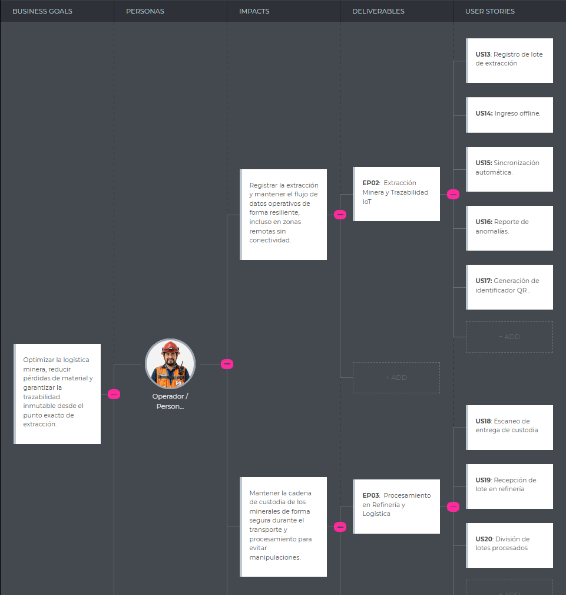
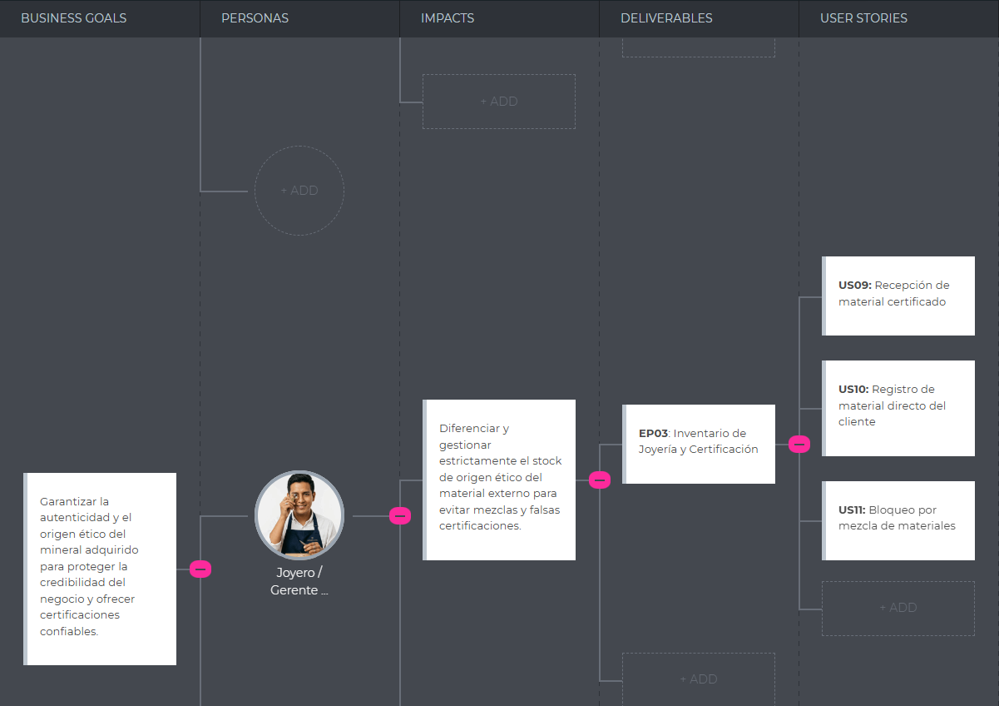
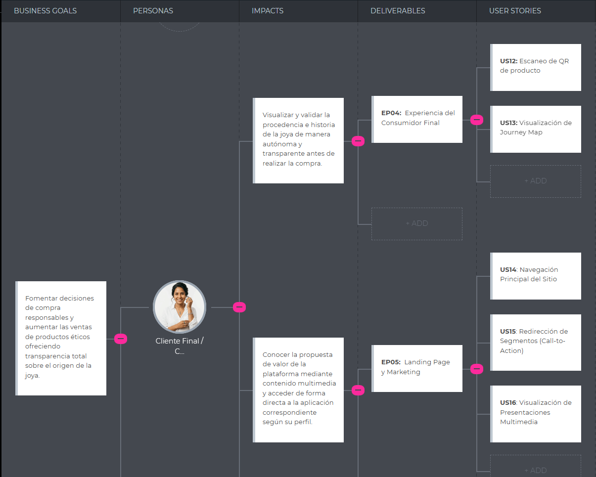

# CAPÍTULO III: REQUIREMENTS SPECIFICATION

## 3.1. Epics

En esta sección se describen las Épicas identificadas para el sistema, las cuales agrupan las funcionalidades clave del negocio.

| Epic / Story ID | Título | Descripción | Criterios de Aceptación | Relacionado con (Epic ID) |
| :--- | :--- | :--- | :--- | :--- |
| **EP01** | Portal Informativo (Landing Page) | Como visitante, quiero navegar por el sitio web estático de OpalTrace para conocer la propuesta de valor, entender cómo funciona la plataforma, explorar los planes de suscripción y ser redirigido a la aplicación web según mi segmento de interés. | No corresponde | No corresponde |
| **EP02** | Extracción Minera y Trazabilidad IoT | Como operador minero, quiero gestionar el registro inicial de lotes de mineral en origen, soportando la captura de datos y sincronización en zonas con conectividad limitada. | No corresponde | No corresponde |
| **EP03** | Procesamiento en Refinería y Logística | Como operario de refinería y logística, quiero controlar la cadena de custodia durante el transporte y registrar la validación y división de lotes al refinar el mineral. | No corresponde | No corresponde |
| **EP04** | Inventario de Joyería y Certificación | Como joyero, quiero administrar mi stock asegurando la separación estricta entre el material ético certificado por OpalTrace y el material de origen externo. | No corresponde | No corresponde |
| **EP05** | Experiencia del Consumidor Final | Como consumidor final, quiero consultar la trazabilidad inmutable y el recorrido completo de mi joya mediante el escaneo de un código QR. | No corresponde | No corresponde |
| **EP06** | Panel de Administración MINEX | Como administrador de MINEX, quiero gestionar y auditar las cuentas de empresas B2B (Mineras/Joyerías) para garantizar la seguridad y evitar fraudes en la red. | No corresponde | No corresponde |
| **EP07** | Requerimientos Técnicos y API | Como desarrollador, quiero implementar la arquitectura backend, la seguridad y las integraciones con servicios externos (Cloud, Mapas, Correos) para soportar las operaciones de OpalTrace. | No corresponde | No corresponde |

## 3.2. User Stories

En esta seccion se detallaran cada User Stories para divididas por las epicas establecidas en la sección anterior:

| ID | Título | Descripción | Criterios de Aceptación | Épica |
| :--- | :--- | :--- | :--- | :--- |
| **US01** | Consulta de propuesta de valor principal | Como Visitante, quiero conocer la propuesta de valor y acceder al video About-the-Product, para entender rápidamente el enfoque de OpalTrace. | *Escenario 1: Presentación de propuesta de valor.*   **Dado que** el visitante accede al portal informativo,  **Cuando** el sistema procese la petición de inicio,  **Entonces** el sistema presentará la descripción principal de la plataforma y proveerá el acceso al material multimedia.   *Escenario 2: Reproducción multimedia.*   **Dado que** el visitante requiere información detallada,  **Cuando** solicite la reproducción del video 'About-the-Product',  **Entonces** el sistema proveerá el flujo del contenido audiovisual correspondiente. | EP01 |
| **US02** | Visualización de pilares de valor | Como Visitante, quiero conocer los tres pilares fundamentales de OpalTrace para entender sus diferenciadores técnicos. | *Escenario 1: Presentación de características principales.*   **Dado que** el visitante explora el portal informativo,  **Cuando** requiera información sobre la estructura del servicio,  **Entonces** el sistema presentará los pilares de valor adjuntando la descripción de cada uno. | EP01 |
| **US03** | Consulta de beneficios por segmento | Como Visitante, quiero ver los beneficios específicos de OpalTrace para cada tipo de actor para identificar mi perfil e iniciar el registro. | *Escenario 1: Beneficios para el sector productor.*   **Dado que** un visitante con perfil minero explora el portal,  **Cuando** solicite información pertinente a su sector,  **Entonces** el sistema presentará los beneficios operativos y proveerá un enrutamiento hacia el flujo de registro B2B.   *Escenario 2: Beneficios para el sector comercial.*   **Dado que** un visitante del perfil joyero o consumidor explora el portal,  **Cuando** solicite información de su sector,  **Entonces** el sistema presentará las ventajas y proveerá el enrutamiento al módulo correspondiente. | EP01 |
| **US04** | Visualización del flujo de trazabilidad | Como Visitante, quiero entender el proceso estructurado de OpalTrace para comprender cómo la plataforma conecta el origen con el consumidor. | *Escenario 1: Detalle secuencial del proceso.*   **Dado que** el visitante consulta la lógica de la plataforma,  **Cuando** el sistema provea la información de trazabilidad,  **Entonces** detallará secuencialmente las etapas integradas.   *Escenario 2: Acceso persistente.*   **Dado que** el visitante navega por el sistema,  **Cuando** solicite el acceso rápido al esquema de funcionamiento,  **Entonces** el sistema proveerá la información requerida. | EP01 |
| **US05** | Comparación de planes comerciales | Como Visitante, quiero contrastar los planes de suscripción de OpalTrace para elegir el nivel de servicio adecuado. | *Escenario 1: Desglose de niveles de suscripción.*   **Dado que** el visitante consulta las opciones comerciales,  **Cuando** el sistema procese la solicitud,  **Entonces** listará los planes disponibles diferenciando explícitamente las funcionalidades habilitadas.   *Escenario 2: Redirección con preselección.*   **Dado que** el visitante evalúa las alternativas,  **Cuando** solicite la adquisición de un plan,  **Entonces** el sistema lo redirigirá al módulo de registro inyectando el plan como parámetro. | EP01 |
| **US06** | Consulta corporativa MINEX | Como visitante, quiero leer la información institucional y acceder al video About-the-Team para validar la confiabilidad de la startup. | *Escenario 1: Presentación de datos institucionales.*   **Dado que** el visitante consulta la información corporativa,  **Cuando** el sistema procese la petición,  **Entonces** proveerá la documentación sobre la misión y visión de MINEX. | EP01 |
| **US07** | Envío de formulario de contacto | Como visitante, quiero enviar una comunicación formal al equipo de MINEX para gestionar consultas técnicas o solicitudes comerciales. | *Escenario 1: Procesamiento exitoso de solicitud.*   **Dado que** el visitante emite una solicitud con datos requeridos válidos,  **Cuando** el sistema reciba la transacción,  **Entonces** registrará el mensaje en la base de datos y retornará un código de confirmación. | EP01 |
| **US08** | Internacionalización del portal | Como visitante, quiero modificar el idioma del portal entre español e inglés para consumir la información en mi dialecto de preferencia. | *Escenario 1: Transición al idioma secundario.*   **Dado que** el portal opera en el idioma nativo,  **Cuando** el visitante envíe una petición de configuración a inglés,  **Entonces** el sistema compilará y proveerá el contenido traducido. | EP01 |
| **US09** | Redirección a módulos de identidad | Como Visitante, quiero ser enrutado hacia los módulos de inicio de sesión y registro para gestionar mis credenciales de acceso. | *Escenario 1: Enrutamiento de autenticación.*   **Dado que** el visitante requiere ingresar al sistema,  **Cuando** envíe la petición de acceso,  **Entonces** el sistema ejecutará la redirección hacia el entorno de inicio de sesión. | EP01 |
| **US10** | Consulta de términos y condiciones | Como Visitante, quiero acceder al documento de términos y condiciones para evaluar el marco legal operativo. | *Escenario 1: Provisión de documento legal.*   **Dado que** el visitante demanda información normativa,  **Cuando** solicite la lectura de los Términos y Condiciones,  **Entonces** el sistema proveerá el documento legal íntegro. | EP01 |
| **US11** | Consulta de políticas de privacidad | Como Visitante, quiero revisar las políticas de privacidad de datos para certificar el manejo y protección de mi información sensible. | *Escenario 1: Provisión de normativa de privacidad.*   **Dado que** el visitante requiere validar el tratamiento de datos,  **Cuando** solicite las Políticas de Privacidad,  **Entonces** el sistema retornará la documentación oficial. | EP01 |
| **US12** | Acceso a canales externos oficiales | Como Visitante, quiero obtener las referencias directas a las redes sociales de OpalTrace para acceder a canales secundarios. | *Escenario 1: Redirección sin pérdida de sesión.*   **Dado que** el visitante interactúa con una referencia externa,  **Cuando** el sistema ejecute la navegación,  **Entonces** derivará el tráfico hacia la red social abriendo un nuevo canal de navegación. | EP01 |
| **US13** | Registro de lote de extracción | Como Operador Minero, quiero registrar un nuevo lote de minerales para que su peso y origen queden documentados en la red. | *Escenario 1: Creación de lote.*   **Dado** que se ingresan los parámetros de peso y tipo,  **Cuando** el sistema procese el registro,  **Entonces** generará un ID único y establecerá el estado "En Origen".   *Escenario 2: Validación de integridad.*   **Dado** el proceso de registro,  **Cuando** se detecten valores negativos o nulos en el peso,  **Entonces** el sistema anulará la transacción y notificará el error de entrada. | EP02 |
| **US14** | Ingreso de datos offline | Como Operador Minero, quiero registrar operaciones sin red para no detener el flujo de trabajo en zonas remotas. | *Escenario 1: Persistencia local.*   **Dado** que no hay conectividad,  **Cuando** se envíe una transacción,  **Entonces** el sistema almacenará el registro localmente en una cola de espera.   *Escenario 2: Prevención de pérdida.*   **Dado** un registro almacenado en caché,  **Cuando** la sesión expire o se cierre,  **Entonces** el sistema mantendrá la persistencia del archivo local hasta su sincronización. | EP02 |
| **US15** | Sincronización automática | Como Operador Minero, quiero que los registros locales se envíen al servidor automáticamente al recuperar la señal. | *Escenario 1: Sincronización transparente.*   **Dado** la existencia de registros locales,  **Cuando** se detecte conexión HTTPS,  **Entonces** el sistema ejecutará la transferencia de datos al servidor.   *Escenario 2: Resolución de conflictos.*   **Dado** una transmisión de cola,  **Cuando** exista duplicidad de IDs,  **Entonces** el servidor validará el timestamp más reciente y descartará la petición redundante. | EP02 |
| **US16** | Reporte de anomalías | Como Supervisor Minero, quiero registrar incidencias sobre un lote para alertar sobre discrepancias antes del transporte. | *Escenario 1: Bloqueo por alerta.*   **Dado** una inconsistencia física,  **Cuando** se emita el reporte,  **Entonces** el sistema bloqueará preventivamente el cambio de estado del lote. | EP02 |
| **US17** | Generación de identificador QR | Como Encargado Logístico, quiero generar un código vinculado al lote para facilitar el rastreo en etapas posteriores. | *Escenario 1: Provisión de etiqueta.*   **Dado** un lote validado,  **Cuando** se solicite el etiquetado,  **Entonces** el sistema proveerá un recurso gráfico codificado con el ID único. | EP02 |
| **US18** | Escaneo de entrega de custodia | Como Transportista, quiero validar la recepción de un lote para registrar el inicio de mi responsabilidad legal. | *Escenario 1: Cambio a 'En Tránsito'.*   **Dado** un lote asignado,  **Cuando** se procese el código,  **Entonces** el sistema actualizará el estado a 'En Tránsito'.   *Escenario 2: Captura de GPS.*   **Dado** el proceso de recepción,  **Cuando** se confirme la custodia,  **Entonces** el sistema registrará automáticamente las coordenadas de ubicación geográfica. | EP03 |
| **US19** | Recepción en refinería | Como Operario de Refinería, quiero confirmar la llegada de la carga para habilitar el procesamiento del mineral. | *Escenario 1: Validación de llegada.*   **Dado** un lote "En Tránsito",  **Cuando** se procese el código en planta,  **Entonces** el sistema registrará la marca de tiempo y actualizará el estado a "En Planta". | EP03 |
| **US20** | División de lotes (Split) | Como Operario de Refinería, quiero fragmentar un lote bruto en unidades menores para su distribución manteniendo la herencia. | *Escenario 1: Herencia de trazabilidad.*   **Dado** un lote refinado,  **Cuando** se procese la división,  **Entonces** el sistema creará registros hijos vinculados al ID original.   *Escenario 2: Validación de masa límite.*   **Dado** el fraccionamiento de lotes,  **Cuando** la sumatoria de peso de los hijos supere al lote padre,  **Entonces** el sistema bloqueará la división por inconsistencia física. | EP03 |
| **US21** | Recepción de material certificado | Como Joyero, quiero registrar el ingreso de material validado por OpalTrace para asegurar un stock 100% ético. | *Escenario 1: Alta de inventario ético.*   **Dado** el arribo de un lote de refinería,  **Cuando** se confirme la recepción,  **Entonces** el sistema incrementará el inventario en la categoría "Certificado". | EP04 |
| **US22** | Registro de material externo | Como Joyero, quiero documentar metales de terceros para evitar la contaminación de los datos de trazabilidad. | *Escenario 1: Aislamiento de stock.*   **Dado** el ingreso de metal externo,  **Cuando** se procese el alta,  **Entonces** el sistema lo registrará inhabilitando la generación de sellos éticos. | EP04 |
| **US23** | Bloqueo por mezcla | Como Joyero, quiero que el sistema restrinja la unificación de stock certificado con externo para proteger la garantía legal. | *Escenario 1: Restricción de mezcla.*   **Dado** una orden de fabricación,  **Cuando** se intente usar ambos tipos de material en un registro conjunto,  **Entonces** el sistema bloqueará la operación. | EP04 |
| **US24** | Consulta de trazabilidad | Como Cliente Final, quiero procesar el código de mi joya para visualizar la historia completa desde la extracción. | *Escenario 1: Validación de origen.*   **Dado** un producto OpalTrace,  **Cuando** se solicite la consulta,  **Entonces** el sistema retornará la secuencia temporal de eventos validados.   *Escenario 2: Identificador no encontrado.*   **Dado** una consulta pública,  **Cuando** el parámetro ingresado no exista en la base inmutable,  **Entonces** el sistema retornará una advertencia de producto no certificado. | EP05 |
| **US25** | Visualización de Journey Map | Como Cliente Final, quiero visualizar el mapa del recorrido del mineral para confirmar el cumplimiento del flujo ético. | *Escenario 1: Provisión de mapa.*   **Dado** el acceso a la trazabilidad,  **Cuando** se solicite el mapa visual,  **Entonces** el sistema graficará los puntos geográficos certificados del lote. | EP05 |
| **US26** | Autenticación administrativa | Como Administrador de MINEX, quiero autenticarme de forma segura para gestionar la infraestructura del sistema. | *Escenario 1: Generación de sesión.*   **Dado** credenciales de administración,  **Cuando** se valide el acceso,  **Entonces** el sistema proveerá un token de sesión con privilegios elevados.   *Escenario 2: Bloqueo de seguridad.*   **Dado** el proceso de autenticación,  **Cuando** se registren tres intentos fallidos consecutivos,  **Entonces** el sistema suspenderá temporalmente la cuenta. | EP06 |
| **US27** | Aprobación de cuentas B2B | Como Administrador, quiero validar las solicitudes de registro empresarial para asegurar actores confiables en la red. | *Escenario 1: Activación de empresa.*   **Dado** un registro pendiente,  **Cuando** se confirmen los datos legales,  **Entonces** el sistema activará las credenciales de producción de la empresa.   *Escenario 2: Rechazo de solicitud.*   **Dado** un registro en revisión,  **Cuando** se determine inconsistencia en los datos legales,  **Entonces** el sistema anulará el proceso y notificará la denegación. | EP06 |
| **US28** | Auditoría de movimientos | Como Administrador, quiero acceder a los registros inmutables para investigar posibles fraudes o discrepancias. | *Escenario 1: Consulta de log.*   **Dado** una investigación,  **Cuando** se consulte un ID de lote,  **Entonces** el sistema retornará el historial completo incluyendo IPs y usuarios asociados. | EP06 |
| **US29** | Implementación de Seguridad JWT | Como Desarrollador, quiero implementar tokens JWT para proteger los endpoints de la API RESTful. | *Escenario 1: Protección de recursos.*   **Dado** una petición al API,  **Cuando** el token sea inválido o expire,  **Entonces** el sistema rechazará la conexión con un código 401 Unauthorized. | EP07 |
| **US30** | Endpoint Gestión de Lotes | Como Desarrollador, quiero un endpoint REST estructurado para gestionar la creación y lectura de los lotes mineros. | *Escenario 1: Estructura JSON.*   **Dado** la necesidad de integración,  **Cuando** se consuma el recurso `/batches`,  **Entonces** el sistema retornará estructuras de datos validadas bajo esquema.   *Escenario 2: Manejo de errores HTTP.*   **Dado** el envío de un payload,  **Cuando** falten campos mandatorios,  **Entonces** retornará un código 400 Bad Request detallando la anomalía. | EP07 |
| **US31** | Servicio Generador de QR | Como Desarrollador, quiero un servicio backend que genere imágenes QR vinculadas a los identificadores únicos. | *Escenario 1: Generación asíncrona.*   **Dado** un ID de lote,  **Cuando** el servicio sea invocado,  **Entonces** retornará un stream de imagen o URI conteniendo el código codificado. | EP07 |
| **US32** | Integración Cloud Storage | Como Desarrollador, quiero integrar AWS S3 para el almacenamiento de evidencias fotográficas de forma escalable. | *Escenario 1: Persistencia de binarios.*   **Dado** una carga de archivo,  **Cuando** se procese la subida,  **Entonces** el sistema almacenará el objeto en el bucket.   *Escenario 2: Restricción de formato.*   **Dado** una subida,  **Cuando** el archivo no corresponda a un mime-type de imagen/documento válido,  **Entonces** el sistema rechazará la carga por seguridad. | EP07 |
| **US33** | Servicio de Generación PDF | Como Desarrollador, quiero compilar certificados en PDF para respaldar la autenticidad del material. | *Escenario 1: Generación de reporte.*   **Dado** la metadata de un lote,  **Cuando** se solicite el certificado,  **Entonces** el sistema generará dinámicamente el documento digital en formato PDF. | EP07 |
| **US34** | Implementación de Rate Limiting | Como Desarrollador, quiero limitar las peticiones concurrentes para evitar ataques de denegación de servicio. | *Escenario 1: Control de tráfico.*   **Dado** un exceso de peticiones desde una misma IP,  **Cuando** se supere el umbral definido,  **Entonces** el sistema bloqueará temporalmente la IP retornando un código 429 Too Many Requests. | EP07 |
| **US35** | Endpoint de Health Check | Como Desarrollador, quiero un endpoint de validación de estado para monitorear la operatividad del servidor. | *Escenario 1: Reporte de salud.*   **Dado** una solicitud al recurso `/health`,  **Cuando** los servicios estén activos,  **Entonces** el sistema retornará un estado 200 OK con el detalle de los componentes.   *Escenario 2: Fallo de dependencia.*   **Dado** la validación,  **Cuando** la base de datos no responda,  **Entonces** retornará un estado 503 Service Unavailable. | EP07 |
| **US36** | Automatización de Backups | Como Desarrollador, quiero configurar copias de seguridad automáticas de la base de datos MySQL para prevenir pérdida de datos. | *Escenario 1: Respaldo programado.*   **Dado** la configuración de tareas,  **Cuando** se alcance el horario definido,  **Entonces** el sistema generará un dump de la base de datos y lo moverá al almacenamiento seguro. | EP07 |

## 3.3 Impact Mapping
### Impact Mapping: Operador / Logística Minera

### Impact Mapping: Joyería

### Impact Mapping: Cliente Final

## 3.4. Product Backlog

| # Orden | Historia de Usuario ID | Título | Descripción | Prioridad | Story Points (1/2/3/5/8) |
| :--- | :--- | :--- | :--- | :--- | :--- |
| 1 | US14 | Navegación Principal del Sitio | Como Visitante, quiero navegar por el portal informativo estructurado para conocer la propuesta de valor y los beneficios del servicio de trazabilidad. | Alta | 3 |
| 2 | US15 | Redirección de Segmentos (Call-to-Action) | Como Visitante perfilado (Minera, Joyero o Cliente), quiero interactuar con enlaces de acción específicos para ser redirigido directamente a mi entorno correspondiente en la Web Application. | Alta | 2 |
| 3 | US16 | Visualización de Presentaciones Multimedia | Como Visitante o Inversor, quiero acceder a los videos de presentación del producto y del equipo para comprender integralmente la solución y la confiabilidad de la startup. | Media | 3 |
| 4 | US01 | Registro de lote de extracción | Como Operador Minero, quiero registrar un nuevo lote de minerales extraídos en la plataforma para que su origen y peso queden documentados desde el inicio. | Alta | 5 |
| 5 | US02 | Ingreso de datos offline | Como Operador Minero, quiero registrar operaciones en el sistema aunque no tenga conexión a la red para no detener el flujo de trabajo en zonas remotas. | Alta | 5 |
| 6 | US03 | Sincronización automática de datos offline | Como Operador Minero, quiero que los registros guardados localmente se envíen al servidor en cuanto recupere la señal para mantener la base de datos actualizada sin intervención manual. | Alta | 8 |
| 7 | US21 | Endpoint Lotes | Como Developer, quiero un endpoint REST estructurado para gestionar (crear, leer) los lotes desde los dispositivos móviles de los operarios. | Alta | 5 |
| 8 | US06 | Escaneo de entrega de custodia | Como Conductor de Transporte, quiero escanear el código QR de un lote al recogerlo para que mi responsabilidad sobre la custodia quede registrada. | Alta | 5 |
| 9 | US07 | Recepción de lote en refinería | Como Operario de Refinería, quiero confirmar la llegada de un lote escaneando su QR para que la mina sepa que el material llegó a destino. | Alta | 5 |
| 10 | US08 | División de lotes procesados (Split) | Como Operario de Refinería, quiero dividir un lote bruto en unidades más pequeñas para distribuirlas a joyerías manteniendo la trazabilidad. | Alta | 8 |
| 11 | US05 | Impresión de código QR del lote | Como Encargado Logístico, quiero generar una etiqueta QR para adherirla físicamente al contenedor y facilitar su rastreo en las siguientes etapas. | Media | 3 |
| 12 | US22 | Servicio QR | Como Developer, quiero un servicio backend que genere imágenes QR vinculadas a IDs de lotes para su posterior impresión. | Media | 5 |
| 13 | US09 | Recepción de material certificado | Como Joyero, quiero registrar el ingreso de lotes validados por la refinería para mantener un inventario de material 100% ético. | Alta | 5 |
| 14 | US10 | Registro de material directo del cliente | Como Joyero, quiero registrar metales adquiridos a clientes particulares de forma independiente para no contaminar la trazabilidad del stock certificado. | Media | 5 |
| 15 | US11 | Bloqueo por mezcla de materiales | Como Joyero, quiero que el sistema me impida unificar material certificado con no certificado para proteger la garantía ética que ofrezco a mis clientes. | Alta | 3 |
| 16 | US12 | Escaneo de QR de producto | Como Cliente, quiero escanear el QR de una joya para ver su origen e información detallada de forma instantánea. | Alta | 3 |
| 17 | US13 | Visualización de Journey Map | Como Cliente, quiero ver un mapa visual del recorrido del mineral desde la mina hasta la tienda para confirmar su ética. | Alta | 8 |
| 18 | US04 | Reporte de anomalías en extracción | Como Supervisor Minero, quiero reportar anomalías sobre un lote específico para alertar sobre posibles pérdidas o discrepancias en el peso antes de su traslado. | Media | 3 |
| 19 | US23 | Cloud Storage | Como Developer, quiero integrar un servicio de almacenamiento en la nube (AWS S3) para guardar las evidencias fotográficas de los reportes y recepciones. | Media | 5 |
| 20 | US24 | Generador PDF | Como Developer, quiero compilar certificados en formato PDF dinámicamente en el backend para respaldar la autenticidad del material. | Media | 5 |
| 21 | US18 | Aprobación de Cuentas B2B (Mineras y Joyerías) | Como Administrador del Sistema, quiero revisar y aprobar las solicitudes de registro de nuevas empresas para garantizar que solo actores verificados participen. | Alta | 5 |
| 22 | US17 | Autenticación de Administrador | Como Administrador del Sistema, quiero autenticarme de forma segura para acceder a las herramientas de configuración y gestión de la plataforma. | Media | 3 |
| 23 | US20 | Implementación de Seguridad JWT | Como Desarrollador, quiero implementar autenticación basada en tokens JWT para proteger todos los endpoints del RESTful API. | Alta | 8 |
| 24 | US19 | Auditoría General de Trazabilidad | Como Administrador del Sistema, quiero acceder a un registro maestro (log) de todos los movimientos de lotes para investigar posibles fraudes. | Baja | 8 |
| 25 | US25 | Rate Limiting | Como Developer, quiero limitar la cantidad de peticiones concurrentes a los endpoints para evitar ataques de denegación de servicio (DDoS). | Baja | 3 |
| 26 | US26 | Health Check | Como Developer, quiero implementar un endpoint de validación de estado para monitorear si el servidor y la base de datos están operativos. | Baja | 2 |
| 27 | US27 | Backups DB | Como Developer, quiero configurar copias de seguridad automáticas diarias de la base de datos para prevenir pérdida de información crítica. | Media | 3 |
