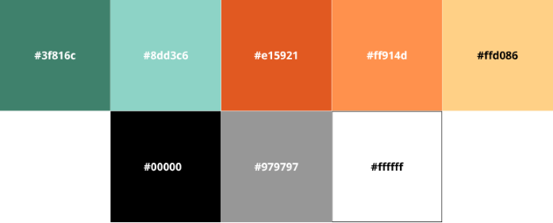

# CAPÍTULO IV: PRODUCT DESIGN

## 4.1. Style Guidelines

### 4.1.1. General Style Guidelines

OpalTrace busca un tono que transmita seguridad inquebrantable, transparencia técnica y compromiso ético. La comunicación es directa y profesional, orientada a generar confianza en un sector donde la autenticidad es el activo más valioso. Se utiliza un lenguaje que denota precisión tecnológica (IA e IoT) pero que se mantiene accesible para el consumidor final, evitando tecnicismos innecesarios y priorizando la claridad sobre la procedencia legal y ética de los minerales.

<u>**Branding**</u>

La identidad visual de OpalTrace refleja la solidez de la industria minera y la sofisticación de la alta joyería. El nombre une la gema ("Opal") con el seguimiento digital ("Trace"), posicionando a la plataforma como el estándar de certificación en el mercado. El logotipo, que integra una estructura geométrica mineral, transmite innovación y trazabilidad de punta a punta, adaptándose con elegancia tanto a entornos industriales como a interfaces de lujo.

  

<u>**Typography**</u>

Para asegurar la legibilidad de datos técnicos y mantener una estética moderna, se establecen dos tipografías complementarias de Google Fonts: Poppins como fuente primaria y Questrial como fuente secundaria.

- **Poppins** es una sans-serif geométrica utilizada para títulos y encabezados principales. Su estructura clara y pesos variables permiten establecer una jerarquía de información robusta, evocando la precisión de los algoritmos de IA utilizados en la plataforma.

- **Questrial** es una sans-serif de trazo limpio y contemporáneo, utilizada para cuerpos de texto, descripciones de procesos y reportes de trazabilidad. Su diseño redondeado aporta una sensación de transparencia y modernidad, facilitando la lectura de certificados digitales.

Los tamaños base son: H1 en 48px, H2 en 36px, H3 en 28px, H4 en 24px, cuerpo de texto en 16px y caption en 13px.

 
   

<u>**Colors**</u>

La paleta de OpalTrace ha sido diseñada para contrastar la naturaleza terrestre de la minería con la energía de la innovación tecnológica y el lujo responsable.

- El color de identidad institucional es el Verde Bosque ('#3f816c'), que simboliza la sostenibilidad y la minería ética. Se utiliza en el footer, botones de registro y elementos de navegación principal. Su variante clara, el Verde Agua ('#8dd3c6'), se emplea en tarjetas de beneficios y fondos suaves para denotar limpieza y verificación.

- El color de énfasis industrial es el Naranja Terracota ('#e15921'), que representa el mineral y la tierra. Se aplica en botones de llamada a la acción (CTAs) y alertas importantes. Se complementa con el Naranja Coral ('#ff914d') para destacar elementos interactivos y el Crema Arena ('#ffd086') para fondos de formularios y secciones que requieren un toque de calidez y distinción.

- Los colores neutros incluyen blanco ('#FFFFFF') para contenedores limpios, negro ('#0000') para textos de alto contraste y gris ('#979797') para textos secundarios y bordes, garantizando el cumplimiento de los estándares de contraste para interfaces profesionales.

  

<u>**Spacing**</u>

Se establece una unidad base de 9px para el espaciado interno. Los márgenes mínimos entre secciones de la landing page son de 18px en mobile y 24px en desktop para permitir un flujo visual ordenado. Los radios de borde (border-radius) se definen en 10px para botones, y de 30px a 70px para las tarjetas de contenido (como se observa en los mockups), suavizando la interfaz y dándole un aspecto moderno y amigable.

### 4.1.2. Web Style Guidelines

La interfaz web de OpalTrace adopta un enfoque responsivo y modular, diseñado para ser eficiente tanto en un centro de control minero como en la mano de un consumidor en una joyería.

<u>**Tipografía**</u>

Se utiliza Poppins para los mensajes de impacto y encabezados de sección, aplicando pesos más gruesos para resaltar la propuesta de valor. Questrial se reserva para la explicación de los procesos de trazabilidad (registro de operación, cadena de custodia, etc.) y términos legales, asegurando que la información técnica sea digerible. El interlineado se mantiene en 1.6 para optimizar la lectura de los beneficios de los planes Silver, Gold y Platinum.

<u>**Colores**</u>

La selección cromática en la web refuerza la jerarquía de usuario. El Verde Bosque (#3f816c) actúa como el ancla visual en la barra de navegación y botones primarios de inicio de sesión. El Naranja Terracota (#e15921) se utiliza exclusivamente para las acciones de conversión más importantes, como "Registrarse" o "Subscribirse". Las secciones de "Nuestros Clientes" utilizan fondos claros y bordes sutiles en los tonos de la paleta para diferenciar los segmentos de Mineros, Joyerías y Compradores sin saturar la pantalla.

<u>**Interacción y responsividad**</u>

Los elementos interactivos cuentan con transiciones suaves de 0.3 segundos. Los formularios de registro y contacto utilizan campos amplios con bordes redondeados y tipografía clara para minimizar el error del usuario. La barra de navegación es fija (sticky) para facilitar el acceso a la sección de "Iniciar Sesión" en todo momento. Se garantiza que los elementos de IA e IoT se representen con iconos limpios y colores que indiquen un estado activo y verificado, manteniendo una experiencia de usuario coherente y de alta tecnología.

## 4.2. Information Architecture

### 4.2.1. Organization Systems

### 4.2.2. Labeling Systems

### 4.2.3. SEO Tags and Meta Tags

### 4.2.4. Searching Systems

### 4.2.5. Navigation Systems

## 4.3. Landing Page UI Design

### 4.3.1. Landing Page Wireframe

### 4.3.2. Landing Page Mock-up

## 4.4. Web Applications UX/UI Design

### 4.4.1. Web Applications Wireframes

### 4.4.2. Web Applications Wireflow Diagrams

### 4.4.2. Web Applications Mock-ups

### 4.4.3. Web Applications User Flow Diagrams

## 4.5. Web Applications Prototyping

## 4.6. Domain-Driven Software Architecture

### 4.6.1. Design-Level EventStorming

### 4.6.2. Software Architecture Context Diagram

### 4.6.3. Software Architecture Container Diagrams

### 4.6.4. Software Architecture Components Diagrams

## 4.7. Software Object-Oriented Design

### 4.7.1. Class Diagrams

## 4.8. Database Design

### 4.8.1. Database Diagrams