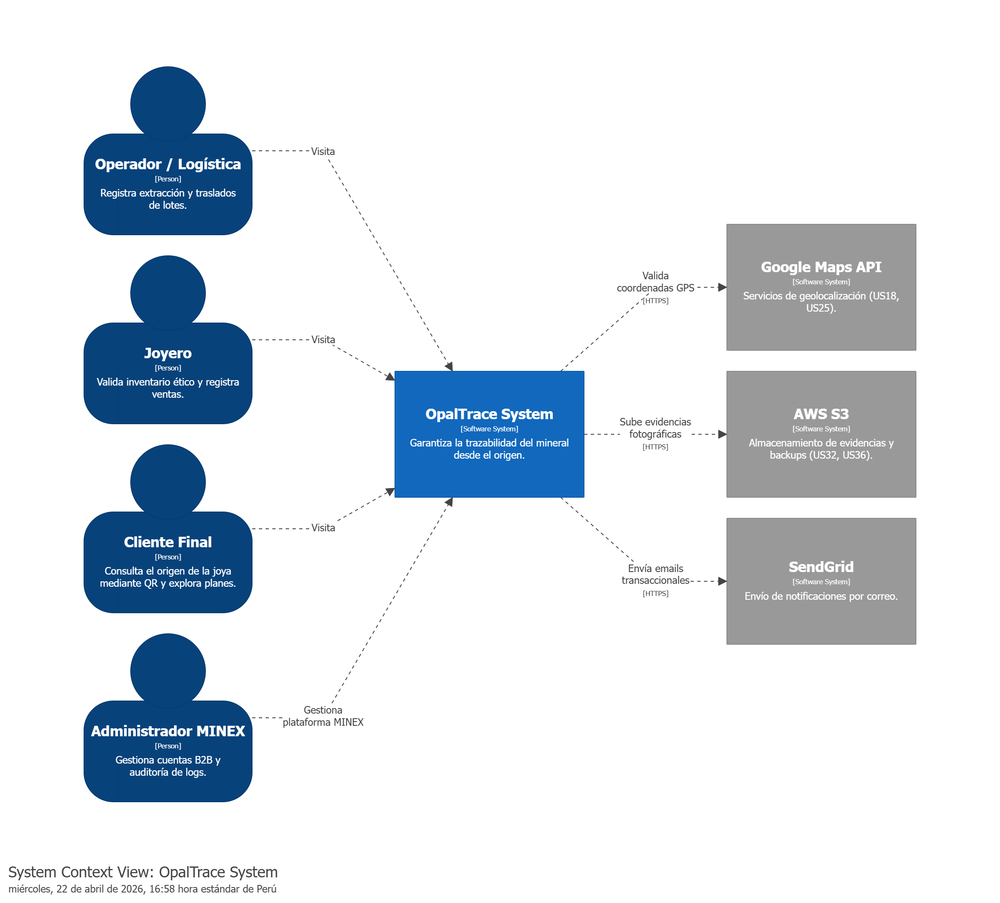

# CAPÍTULO IV: PRODUCT DESIGN

## 4.1. Style Guidelines

### 4.1.1. General Style Guidelines

### 4.1.2. Web Style Guidelines

## 4.2. Information Architecture

### 4.2.1. Organization Systems

### 4.2.2. Labeling Systems

### 4.2.3. SEO Tags and Meta Tags

### 4.2.4. Searching Systems

### 4.2.5. Navigation Systems

## 4.3. Landing Page UI Design

### 4.3.1. Landing Page Wireframe

### 4.3.2. Landing Page Mock-up

## 4.4. Web Applications UX/UI Design

### 4.4.1. Web Applications Wireframes

### 4.4.2. Web Applications Wireflow Diagrams

### 4.4.2. Web Applications Mock-ups

### 4.4.3. Web Applications User Flow Diagrams

## 4.5. Web Applications Prototyping

## 4.6. Domain-Driven Software Architecture

### 4.6.1. Design-Level EventStorming

### 4.6.2. Software Architecture Context Diagram
Para definir los límites de la solución, se ha elaborado el diagrama de contexto siguiendo el modelo C4. Este diagrama permite visualizar cómo el sistema **OpalTrace** interactúa con los diversos actores del negocio (Operadores Mineros, Joyerías, Clientes Finales y Administradores de **MINEX**) y con los servicios externos críticos como Google Maps API para la geolocalización, AWS S3 para el almacenamiento de evidencias inmutables y SendGrid para la gestión de notificaciones.

*Figura 1: Diagrama de Contexto del Sistema OpalTrace.*
  
### 4.6.3. Software Architecture Container Diagrams
En este segundo nivel de abstracción, se detalla la distribución de responsabilidades. Se ha optado por una arquitectura desacoplada donde el front-end se divide en un **Portal Informativo** (Landing Page) para la captación y redirección, y una **OpalTrace Web App** (PWA) desarrollada en Angular que permite la resiliencia operativa en zonas mineras. El back-end se estructura sobre una API RESTful con Spring Boot, la cual orquesta la lógica de trazabilidad y se comunica con un motor de base de datos MySQL.

*Figura 2: Diagrama de Contenedores de OpalTrace.*
### 4.6.4. Software Architecture Components Diagrams
Finalmente, se presenta el desglose interno de la API RESTful. Se distinguen tres módulos principales: el componente de Seguridad (IAM) para la protección de recursos mediante JWT, el componente de Logística y Trazabilidad para el seguimiento de la cadena de suministro en origen, y el componente de Inventario y Certificación para procesar la división de lotes y garantizar que el stock de joyería no se contamine con material no verificado.

*Figura 3: Diagrama de Componentes internos de la API RESTful.*

### 4.7.1. Class Diagrams

## 4.8. Database Design

### 4.8.1. Database Diagrams
