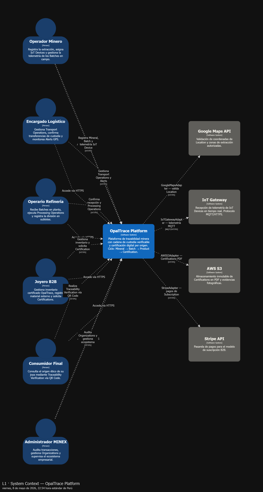
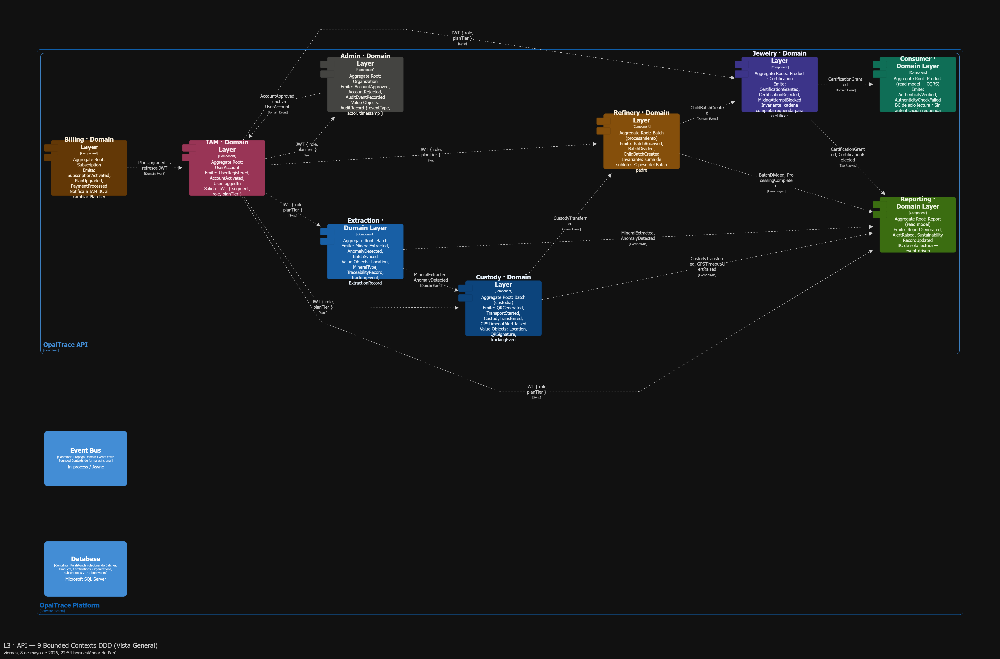
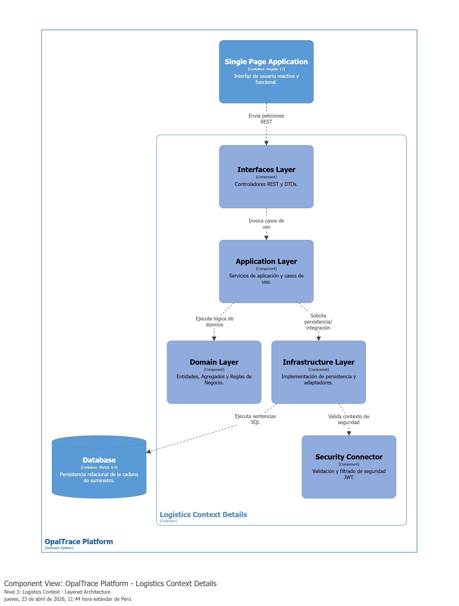

# CAPÍTULO IV: PRODUCT DESIGN

## 4.1. Style Guidelines

### 4.1.1. General Style Guidelines

### 4.1.2. Web Style Guidelines

## 4.2. Information Architecture

### 4.2.1. Organization Systems

### 4.2.2. Labeling Systems

### 4.2.3. SEO Tags and Meta Tags

### 4.2.4. Searching Systems

### 4.2.5. Navigation Systems

## 4.3. Landing Page UI Design

### 4.3.1. Landing Page Wireframe

### 4.3.2. Landing Page Mock-up

## 4.4. Web Applications UX/UI Design

### 4.4.1. Web Applications Wireframes

### 4.4.2. Web Applications Wireflow Diagrams

### 4.4.2. Web Applications Mock-ups

### 4.4.3. Web Applications User Flow Diagrams

## 4.5. Web Applications Prototyping

## 4.6. Domain-Driven Software Architecture

### 4.6.1. Design-Level EventStorming

### 4.6.2. Software Architecture Context Diagram
El diagrama de contexto establece los límites de la plataforma **OpalTrace** y su interacción con los diferentes perfiles de usuario y sistemas externos críticos para el negocio. 

A nivel de usuarios, el sistema orquesta las acciones del Operador Minero (registro de extracción), el Joyero B2B (gestión de inventario y pagos), el Cliente Final (consulta de trazabilidad ética) y el Administrador de MINEX (auditoría). A nivel de integraciones externas, la plataforma se comunica con un **IoT Gateway** para recibir telemetría en tiempo real, delega el procesamiento de suscripciones a **Stripe API**, valida la geolocalización de los lotes mediante **Google Maps API** y garantiza la inmutabilidad de los certificados y evidencias almacenándolos de forma segura en **AWS S3**.

*Figura 1: Diagrama de Contexto del Sistema OpalTrace.*
  
### 4.6.3. Software Architecture Container Diagrams
En el segundo nivel de abstracción (Contenedores), se ha diseñado una arquitectura altamente desacoplada orientada a la escalabilidad y la resiliencia operativa.

La interfaz de usuario se gestiona mediante una separación de responsabilidades: una **Web Application** (basada en Java/Spring Boot) encargada exclusivamente de entregar los recursos estáticos, y una **Single Page Application (SPA)** desarrollada en Angular 17 que se ejecuta en el navegador del cliente. Esta SPA consume los servicios expuestos por la **API Application** (Spring Boot), la cual centraliza toda la lógica de negocio, validaciones ESG y reglas de trazabilidad. Toda la información de la cadena de suministro y metadatos se persiste de forma estructurada en un contenedor de **Base de Datos** MySQL 8.0.

*Figura 2: Diagrama de Contenedores de OpalTrace.*
### 4.6.4. Software Architecture Components Diagrams
Para el nivel de componentes, y siguiendo las mejores prácticas de ingeniería de software para sistemas complejos, se ha adoptado el patrón **Domain-Driven Design (DDD)** y una **Arquitectura de Capas (Layered Architecture)**, lo cual se detalla en los siguientes dos diagramas.

##### A. API Application - Bounded Contexts Diagram
Para evitar el anti-patrón del monolito, la API principal se ha descompuesto en **Bounded Contexts** (Contextos Delimitados) altamente cohesivos e independientes. Destacan el *Logistics Bounded Context* (gestión de la extracción y transporte desde la mina) y el *Inventory Bounded Context* (certificación y segregación del stock en la joyería). Además, se ha integrado un *Billing Bounded Context* para orquestar la monetización a través de Stripe, y un *IAM Bounded Context* para la gestión de identidades. Todos estos módulos comparten utilidades transversales mediante un *Shared Bounded Context*.

*Figura 3: Diagrama de Componentes de la API orientado a Domain-Driven Design.*

##### B. Logistics Context - Layered Architecture (Zoom-In)
Realizando una inspección detallada dentro del *Logistics Bounded Context*, se evidencia una estricta separación de responsabilidades (*Clean/Layered Architecture*). 
1. **Interfaces Layer:** Expone los controladores REST y gestiona los DTOs consumidos por la SPA.
2. **Application Layer:** Orquesta los casos de uso específicos del sistema sin acoplarse a tecnologías externas.
3. **Domain Layer:** Contiene el corazón del software, las entidades puras y las reglas de negocio de la herencia de los minerales.
4. **Infrastructure Layer:** Se encarga de la comunicación hacia el exterior, interactuando con la base de datos mediante JDBC, validando el Security Connector (JWT) e invocando APIs externas como Google Maps.

*Figura 4: Vista interna del Logistics Bounded Context basado en arquitectura de capas.*

### 4.7.1. Class Diagrams

## 4.8. Database Design

### 4.8.1. Database Diagrams
