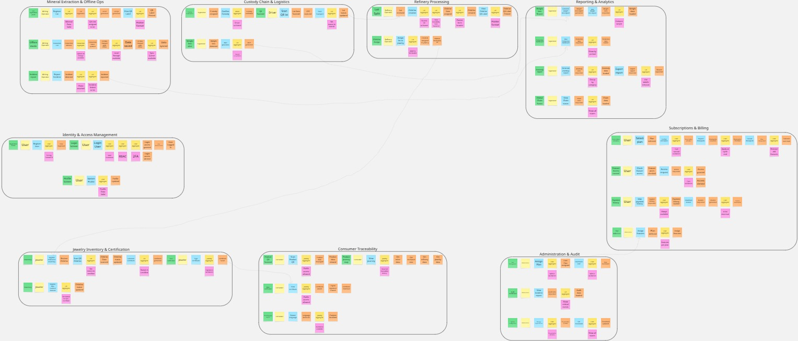

# CAPÍTULO IV: PRODUCT DESIGN

## 4.1. Style Guidelines

### 4.1.1. General Style Guidelines

### 4.1.2. Web Style Guidelines

## 4.2. Information Architecture

### 4.2.1. Organization Systems

### 4.2.2. Labeling Systems

### 4.2.3. SEO Tags and Meta Tags

### 4.2.4. Searching Systems

### 4.2.5. Navigation Systems

## 4.3. Landing Page UI Design

### 4.3.1. Landing Page Wireframe

### 4.3.2. Landing Page Mock-up

## 4.4. Web Applications UX/UI Design

### 4.4.1. Web Applications Wireframes

### 4.4.2. Web Applications Wireflow Diagrams

### 4.4.2. Web Applications Mock-ups

### 4.4.3. Web Applications User Flow Diagrams

## 4.5. Web Applications Prototyping

## 4.6. Domain-Driven Software Architecture
OpalTrace utiliza el enfoque de Domain-Driven Design (DDD) con el fin de facilitar la colaboración entre developers y expertos en el sector. Para esto, el sistema utiliza una organización entre 9 Bounded Context independientes de manera que logramos separar claramente las responsabilidades. Con esto también resaltamos las funcionalidades clave para hacer del proyecto altamente escalable de manera que se pueda incrementar la eficiencia de  procesos como el mantenimiento o la escalación. 

A continuación se muestran y describen los Bounded Context que forman la solución:
| Bounded Context | Descripción | Módulos incluidos |
| :--- | :--- | :--- |
| **Identity & Access Management** | Autenticación, autorización y gestión de cuentas por rol (RBAC). | Identity & Access Management|
| **Mineral Extraction & Offline Ops** | Registro de lotes, operación offline y anomalías en campo. | Extracción Minera y Operaciones Offline|
| **Custody Chain & Logistics** | Transferencia de responsabilidad y transporte de lotes. | Logística y Cadena de Custodia |
| **Refinery Processing** | Procesamiento, división de lotes y asignación a joyerías. | Procesamiento en Refinería|
| **Jewelry Inventory & Certification** | Inventario ético, certificación y emisión de documentos. | Inventario de Joyería y Certificación|
| **Consumer Experience** | Verificación pública del origen de joyas por consumidores. | Experiencia del Consumidor Final|
| **Administration & Audit** | Supervisión global, roles y configuración del sistema. | Panel de Administración|
| **Reporting & Analytics** | Dashboards, reportes de merma, ESG y exportaciones. | Reportes y Analytics |
| **Subscriptions & Billing** | Gestión de planes, acceso escalonado a funcionalidades y facturación. | Subscriptions & Billing |

### 4.6.1. Design-Level EventStorming
Utilizando la técnica de Event Storming a nivel de diseño, hemos logrado identificar los eventos de dominio y los comandos quienes cargan con la lógica de negocio en cada Bounded Context.

A continuación, se muestra la matriz de interdependencias entre los módulos:
| Origen (Evento) | Destino (Comando) | Descripción |
| :--- | :--- | :--- |
| **Custody Chain & Logistics:** Alert Generated | **Reporting & Analytics:** Generate weight loss report | Genera un reporte de perdida de peso cuando se genere una alerta. |
| **Refinery Processing:** Child lot destination set| **Jewelry Inventory & Certification:** Register Child lot in Inventory | El proceso en el que las joyerías reciben el lote de mineral. |
| **Jewelry Inventory & Certification:** Certificate Saved | **Consumer Traceability:** View certificate | Permite al consumidor ver el certificado generado por los joyeros. |
| **Mineral Extraction & Offline Ops:** Incident reported | **Reporting & Analytics:** View Production dashboard | Permite al supervisor revisar los incidentes que suceden durante el proceso de mineria. |
| **Administration & Audit:** User Plan assigned | **Subscriptions & Billing:** Assign features | El administrador habilita al usuario la capacidad de usar features detrás de los planes de paga. |

**EventStorming**

Para visualizar el EventStorming de mejor manera recomendamos ingresar al siguiente link:
[Visualizar EventStorming en Miro](https://miro.com/welcomeonboard/dnFtM2FkSy9ZaHNPQjdWa1Z5eUZMTHlUZitMZGlQdjlTMjBKR0ZoNG5iKzJoRER5SUs0V1pGVVoyUFN4N3hrNkh4WmVjeTMyWGZ1TkZQT2NYL0tYK3pDUlh2ZktLbGhuM1NwWlMvSTRCYk1oZm9yNVJzcHJDb1Eyc0dVNDZYcWtBS2NFMDFkcUNFSnM0d3FEN050ekl3PT0hdjE=?share_link_id=896920918108)

### 4.6.2. Software Architecture Context Diagram

### 4.6.3. Software Architecture Container Diagrams

### 4.6.4. Software Architecture Components Diagrams

## 4.7. Software Object-Oriented Design

### 4.7.1. Class Diagrams

## 4.8. Database Design

### 4.8.1. Database Diagrams