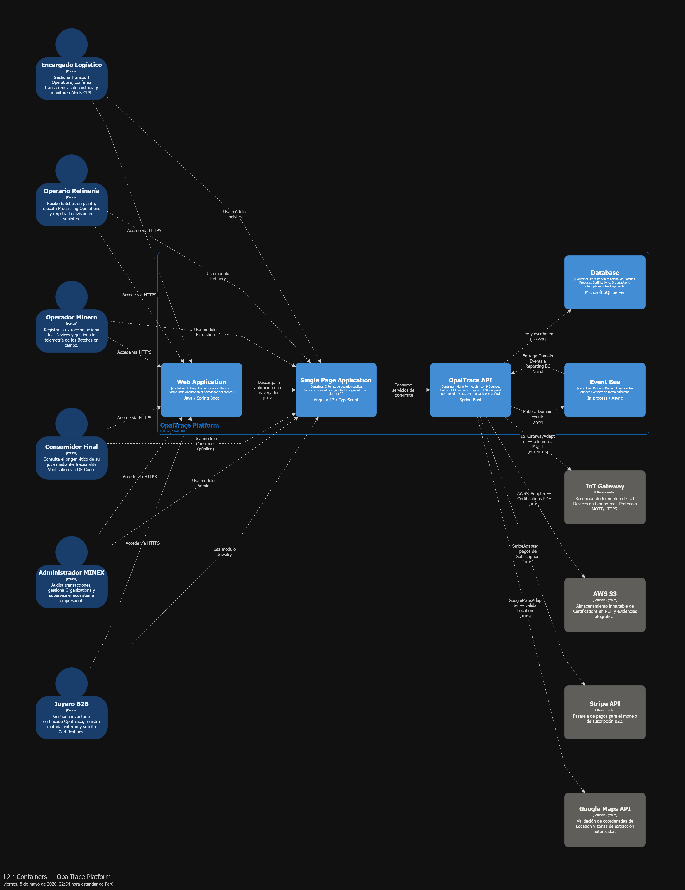
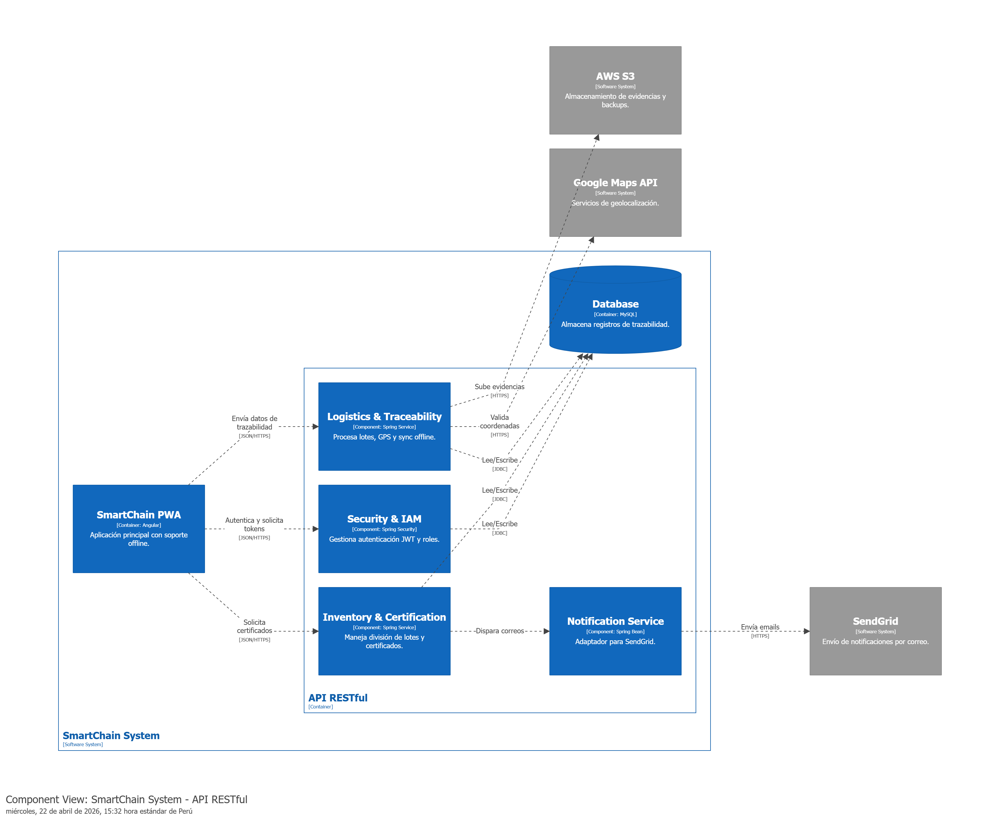

# CAPÍTULO IV: PRODUCT DESIGN

## 4.1. Style Guidelines

### 4.1.1. General Style Guidelines

### 4.1.2. Web Style Guidelines

## 4.2. Information Architecture

### 4.2.1. Organization Systems

### 4.2.2. Labeling Systems

### 4.2.3. SEO Tags and Meta Tags

### 4.2.4. Searching Systems

### 4.2.5. Navigation Systems

## 4.3. Landing Page UI Design

### 4.3.1. Landing Page Wireframe

### 4.3.2. Landing Page Mock-up

## 4.4. Web Applications UX/UI Design

### 4.4.1. Web Applications Wireframes

### 4.4.2. Web Applications Wireflow Diagrams

### 4.4.2. Web Applications Mock-ups

### 4.4.3. Web Applications User Flow Diagrams

## 4.5. Web Applications Prototyping

## 4.6. Domain-Driven Software Architecture

### 4.6.1. Design-Level EventStorming

### 4.6.2. Software Architecture Context Diagram
Para definir los límites de la solución SmartChain, se ha elaborado el diagrama de contexto siguiendo el modelo C4. Este diagrama permite visualizar cómo el sistema interactúa con los diversos actores (Mineras, Joyerías, Clientes Finales y Administradores) y con los servicios externos críticos como Google Maps API para la geolocalización, AWS S3 para el almacenamiento de evidencias inmutables y SendGrid para la gestión de notificaciones transaccionales.

**Explicación de las interacciones:**
* **Servicios de Localización:** El sistema consume la API de Google Maps para validar las coordenadas GPS capturadas durante los traslados de material.
* **Persistencia de Evidencias:** Se integra con AWS S3 para garantizar que las fotografías de los lotes y los certificados PDF se almacenen de forma segura y escalable.
  
### 4.6.3. Software Architecture Container Diagrams
En este segundo nivel de abstracción, se detalla la distribución de responsabilidades entre los contenedores de software. Se ha optado por una arquitectura desacoplada donde el front-end, desarrollado como una Progressive Web App (PWA) en Angular, permite la resiliencia operativa en zonas mineras con conectividad limitada. El back-end se estructura sobre una API RESTful con Spring Boot, la cual orquesta la lógica de negocio y se comunica con un motor de base de datos relacional MySQL para la persistencia de datos estructurados.

**Detalle de contenedores:**
* **SmartChain PWA:** Aplicación cliente que gestiona el almacenamiento local para la sincronización posterior de datos.
* **API RESTful:** Servidor de aplicaciones Java que expone los endpoints necesarios para la captura de telemetría IoT y gestión de usuarios.

### 4.6.4. Software Architecture Components Diagrams
Finalmente, se presenta el desglose interno de la API RESTful. El sistema se ha organizado siguiendo el patrón de diseño por componentes para facilitar el mantenimiento y la escalabilidad. Se distinguen tres módulos principales: el componente de Seguridad (IAM) para la protección de recursos mediante tokens JWT, el componente de Logística para el seguimiento de la cadena de suministro, y el componente de Inventario para la gestión de certificaciones de joyería ética.

**Componentes destacados:**
* **Security Component:** Implementa Spring Security para filtrar cada solicitud y validar los permisos según el rol del usuario (B2B o Administrador).
* **Logistics Component:** Encargado de procesar los eventos de trazabilidad y la integración con el servicio de mapas.
## 4.7. Software Object-Oriented Design

### 4.7.1. Class Diagrams

## 4.8. Database Design

### 4.8.1. Database Diagrams
