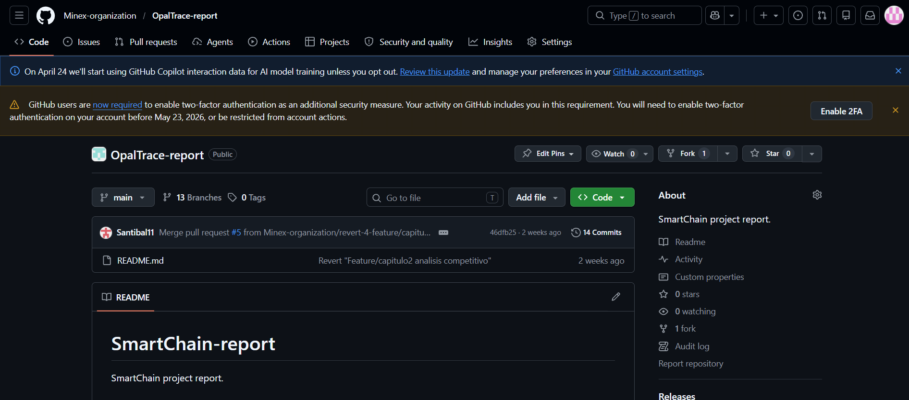
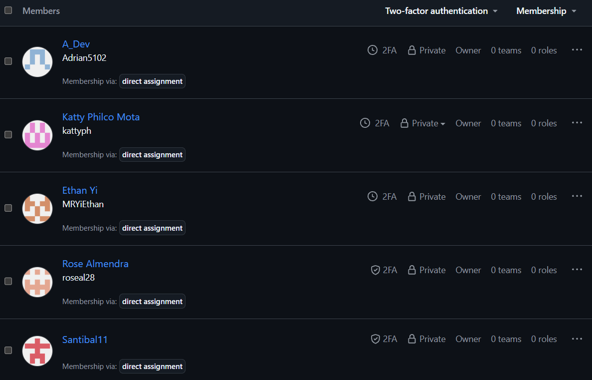
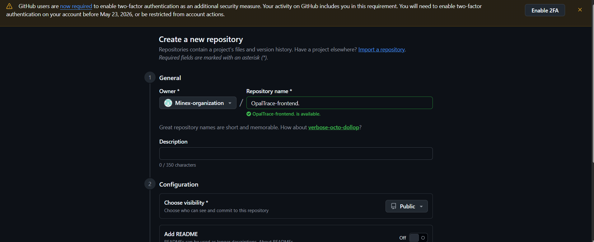

# CAPÍTULO V: Product Implementation, Validation & Deployment

## 5.1. Software Configuration Management

### 5.1.1. Software Development Environment Configuration

**-Project Management:**
1. Herramienta: Trello
Propósito: Gestión de tareas, planificación de sprints y seguimiento del progreso del equipo mediante tableros Kanban. 

**-Requirements Management:**
1. Herramienta: UXPressia
Propósito: Creación de artefactos de needfinding como User Personas, User Journey Maps y Empathy Maps para comprender las necesidades del usuario.
2. Herramienta: Miro
Propósito: Desarrollo de Event Storming (Big Picture y Process Level) para el modelado de procesos y definición del alcance del sistema.
3. Herramienta: Gherkin
Propósito: Definición de criterios de aceptación y escenarios de prueba en formato Given–When–Then.

**-Product UX/UI Design:**
1. Herramienta: Figma
Propósito: Diseño de wireframes y mockups de la interfaz del sistema, incluyendo la landing page.

**-Software Development:**
1. Herramienta: Visual Studio Code
Propósito: Entorno de desarrollo utilizado para la programación del sistema.
2. Herramienta: GitHub
Propósito: Control de versiones y trabajo colaborativo mediante repositorios, commits y ramas. Cada miembro del equipo clonará el repositorio para desarrollar de manera distribuida sus features.
3. Tecnología Frontend: Angular
Lenguaje: TypeScript
Propósito: Desarrollo de la interfaz web interactiva del sistema.
4. Tecnología Backend: Node.js 
Propósito: Desarrollo de la lógica del servidor, manejo de peticiones HTTP y conexión con la base de datos.
5. Base de Datos: Microsoft SQL Server
Propósito: Almacenamiento y gestión de la información del sistema.
6. Herramienta: WebStorm
Propósito: Entorno de desarrollo especializado para aplicaciones JavaScript y TypeScript, especialmente útil para nuestro proyecto OpalTrace con Angular.

**-Software Deployment:**
1. Herramienta: GitHub Pages
Propósito: Despliegue de la solución de cada producto digital de OpalTrace desde nuestro repositorio de Github.

**-Software Documentation:**
1. Herramienta: Markdown
Propósito: Documentación técnica del proyecto (README y documentación del código).
2. Herramienta: Structurizr
Propósito: Elaboración de diagramas de arquitectura del sistema utilizando el modelo C4 (contexto, contenedores, componentes y código).

### 5.1.2. Source Code Management
Para el control de versiones y la organización ordenada del código de nuestro proyecto OpalTrace, 
el equipo utiliza GitHub como plataforma principal. GitHub nos permite almacenar código fuente 
del Landing Page, Front-End, Back-End llevar un registro histórico de cambios, colaborar de manera estructurada y garantizar trazabilidad durante todo el ciclo de desarrollo. Por ende, creamos la organización Minex-Organization, que incluye los siguientes repositorios:
| Solución  | Nombre del repositorio  |  Enlace  |
|---|---|---|
| Report | OpalTrace-report  | https://github.com/Minex-organization/OpalTrace-report.git  |
| Landing Page  | OpalTrace-landing  |  https://github.com/Minex-organization/OpalTrace-landing.git |
| Front-End  |  OpalTrace-frontend  | https://github.com/Minex-organization/OpalTrace-frontend.git  |
| Back-End (Web Services)  | OpalTrace-backend   |   |

Nuestro equipo de trabajo ha aplicado el flujo GitFlow, de acuerdo al artículo "A successful Git branching model” de Vincent Driessen. Nuestra organización cuenta con dos ramas permanentes: master (rama que refleja estados listos para entregas) y develop (rama de integración). Desde la rama develop crearemos ramas feature con la nomenclatura "feature/chapter-#-description", por ejemplo feature/chapter-ii-interviews y en el caso un miembro del equipo desarrolla en totalidad un capítulo "feature-chapter-#-content" en estas nuevas ramas feature cada miembro realiza el trabajo de forma aislada, una vez terminado se fusiona en develop para integrarla en la próxima versión. Una vez que se acerque la fecha de entrega del producto se creama una rama release a partir de develop, donde se realizarán tareas menores como la correción de errores. Finalmente la rama se fusiona en master y en develop para asegurar que los arreglos se mantengan en el futuro.

En síntesis cada nueva funcionalidad se desarrollará en un feature Branch, mientras que las versiones preparadas para lanzamiento se manejarán en release branches con la convención release/vX.Y.Z aplicando Semantic Versioning. Finalmente, las correcciones urgentes se resolverán mediante hotfix branches con el formato hotfix/vX.Y.Z. Todas las confirmaciones seguirán las reglas de Conventional Commits para mantener así un historial claro y estructurado, asegurando un buen camino en el registro de versiones para OpalTrace.

**Repositorio report**

**Repositorio Landing Page**

**Repositorio FrontEnd**

**Repositorio BackEnd**
//añadir captura de pantallas

### 5.1.3. Source Code Style Guide & Conventions

Todos los identificadores (archivos, clases, métodos, variables, etc.) deben estar en inglés.

1. HTML

- Etiquetas y atributos en minúsculas  
`<section id="mineral-tracking"></section>`  

- Cerrar siempre los elementos  
``

- Comillas dobles para valores de atributos  
`<button type="button" class="primary-button"></button>`

- Incluir siempre alt (y width/height si es posible) en imágenes  
``

- Sangría de 2 espacios  

2. CSS

- kebab-case para nombres de clases e IDs  
 .mineral-card { … }  
 #tracking-map { … }  

- BEM opcional en componentes complejos  
 .tracking-card__status--active { … }  

- Agrupar o alfabetizar propiedades  

- Omitir unidades en valores cero  
 margin: 0;  

- Separar bloques con una línea en blanco  

3. JavaScript

- camelCase para variables y funciones  
 `function calculateMineralWeight() { }`

- Usar `const` y `let` en lugar de `var`  

- Evitar funciones largas (máx. 20–30 líneas)  

- Manejo de errores con `try/catch`  

- Uso de ES6+ (arrow functions, destructuring, etc.)  

4. TypeScript (Angular)

- Seguir la Angular Style Guide (https://angular.io/guide/styleguide)  
- Convenciones de nombres:  
 • Clases/Componentes/Servicios: PascalCase, p. ej. MineralTrackingService  
 • Interfaces/Tipos: PascalCase, p. ej. MineralData  
 • Variables/Métodos/Propiedades: camelCase, p. ej. getMineralData()  
 • Constantes: UPPER_SNAKE_CASE, p. ej. MAX_TRACKING_DISTANCE  
- Archivos en kebab-case, p. ej. mineral-tracking.component.ts  
- Siempre usar punto y coma al final de cada línea  
- Orden de imports: externos → módulos del proyecto → relativo  
- Evitar any; preferir tipado estricto  
- Lint y formateo automáticos con ESLint y Prettier  

5. Java (Spring Boot)

- Seguir Google Java Style Guide (https://google.github.io/styleguide/javaguide.html)  
- Convenciones de nombres:  
 • Clases/Enums: PascalCase, p. ej. MineralShipment  
 • Métodos/Variables: camelCase, p. ej. calculateRoute()  
 • Constantes: UPPER_SNAKE_CASE, p. ej. DEFAULT_TIMEOUT  
- Sangría de 4 espacios (sin tabs)  
- Llaves en la misma línea, p. ej.  
 public class TrackingService {  
 public void processData() {  
 // …  
 }  
 }  
- Una instrucción por línea  
- Uso de anotaciones de Spring Boot: @RestController, @Service, @Repository  
- Separación por capas: Controller, Service, Repository, Model  

### 5.1.4. Software Deployment Configuration
- Creación de la Landing Page:
1. Se crea un repositorio (OpalTrace-landing) desde Minex-organization

2. Agregar a los miembros del equipo

3. Habilitar GitHub Pages en branch master y ruta "/(root)"

- Creación de Front-End App
1. Creación del repositorio (OpalTrace-frontend) dentro de la organización Minex-organization

2. Agregar a los miembros del equipo

## 5.2. Landing Page, Services & Applications Implementation

### 5.2.1. Sprint 1

### 5.2.1.1. Sprint Planning 1
En esta sección se detallan los aspectos clave del Sprint Planning Meeting correspondiente al Sprint 1 del proyecto. El enfoque principal de este sprint es el desarrollo e implementación de la **Landing Page** del sistema de trazabilidad minera, la cual permitirá comunicar la propuesta de valor, beneficios y funcionalidades de la plataforma a los usuarios finales.

| Sprint # | Sprint 1 |
|----------|---------|
| Date | 2026 - 04 - 20 |
| Time | 10:00 PM |
| Location | Reunión virtual vía Discord |
| Prepared by | Armestar Felipa, Adrian Andres |
| Attendees (to planning meeting) | Armestar Felipa, Adrian Andres; Baldeon Vivar, Santiago Armando; Philco Mota, Katty Yolanda; Vergraray Calderon, Rose Almendra; Yi Torrejon, Ethan Raul |
| Sprint n – 1 Review Summary | No existe sprint previo |
| Sprint 1 Goal | Our focus is on designing and deploying the landing page of our traceability platform. We believe it will provide clarity about our solution and attract potential users. This will be confirmed when users can navigate and understand the platform through the landing page. |
| Sprint 1 Velocity | 20 story points |
| Sum of story points | 20 story points |

---

### 5.2.1.2. Aspect Leaders and Collaborators

En este sprint se busca completar la landing page del sistema, incluyendo su diseño visual, contenido informativo y despliegue. Para lograr una correcta organización del equipo, se ha definido la siguiente matriz de liderazgo y colaboración:

| Team Member                         | GitHub username | Diseño Landing Page | Desarrollo Frontend | Despliegue |
|------------------------------------|-----------------|--------------------|---------------------|------------|
| Armestar Felipa, Adrian Andres     | adrianAF        | L                  | C                   | C          |
| Baldeon Vivar, Santiago Armando    | Santibal11      | C                  | L                   | C          |
| Philco Mota, Katty Yolanda         | kattyPM         | C                  | C                   | L          |
| Vergraray Calderon, Rose Almendra  | roseVC          | C                  | C                   | C          |
| Yi Torrejon, Ethan Raul            | ethanYT         | C                  | C                   | C          |

---

### 5.2.1.3. Sprint Backlog 1

El objetivo principal del Sprint 1 es desarrollar una **Landing Page funcional** basada en la épica **EP05: Landing Page y Marketing**, específicamente en la historia de usuario **US17: Navegación Principal del Sitio**.

| Sprint # | User Story ID | User Story Title | Task ID | Task Title | Description | Estimation (hours) | Assigned To | Status | Story Points |
|----------|--------------|------------------|---------|------------|-------------|--------------------|-------------|--------|--------------|
| Sprint 1 | US17 | Navegación Principal del Sitio | T01 | Diseñar estructura de la landing | Definir secciones principales: hero, servicios, beneficios, contacto | 2 | Armestar Felipa | Done | 3 |
| Sprint 1 | US17 | Navegación Principal del Sitio | T02 | Crear diseño UI/UX | Diseñar prototipo visual de la landing page | 3 | Baldeon Vivar | Done | 3 |
| Sprint 1 | US17 | Navegación Principal del Sitio | T03 | Implementar header | Crear barra de navegación con menú y scroll | 2 | Yi Torrejon | Done | 2 |
| Sprint 1 | US17 | Navegación Principal del Sitio | T04 | Implementar hero section | Sección principal con mensaje y CTA | 2 | Vergraray Calderon | Done | 2 |
| Sprint 1 | US17 | Navegación Principal del Sitio | T05 | Implementar sección servicios | Mostrar funcionalidades clave del sistema | 2 | Armestar Felipa | Done | 2 |
| Sprint 1 | US17 | Navegación Principal del Sitio | T06 | Implementar sección beneficios | Explicar ventajas del sistema | 2 | Philco Mota | Done | 2 |
| Sprint 1 | US17 | Navegación Principal del Sitio | T07 | Implementar sección contacto | Formulario y datos de contacto | 2 | Baldeon Vivar | Done | 2 |
| Sprint 1 | US17 | Navegación Principal del Sitio | T08 | Implementar diseño responsive | Adaptar a móviles y tablets | 3 | Yi Torrejon | Done | 2 |
| Sprint 1 | US17 | Navegación Principal del Sitio | T09 | Configurar navegación scroll | Implementar navegación por anclas | 2 | Philco Mota | Done | 1 |
| Sprint 1 | US17 | Navegación Principal del Sitio | T10 | Despliegue en la nube | Publicar la landing page | 2 | Vergraray Calderon | Done | 1 |

---

### 5.2.1.4. Development Evidence for Sprint Review

| Repository | Branch | Commit Id | Commit Message | Commit Message Body | Committed on |
|------------|--------|-----------|----------------|---------------------|--------------|
| traceability-landing | feature/header | a12b34 | feat: add header component | Implementación del menú principal con navegación | 2026-04-21 |
| traceability-landing | feature/hero | b45c67 | feat: hero section | Se agregó sección principal con CTA | 2026-04-21 |
| traceability-landing | feature/services | c78d90 | feat: services section | Se implementaron servicios del sistema | 2026-04-22 |
| traceability-landing | feature/benefits | d12e34 | feat: benefits section | Se añadieron beneficios del producto | 2026-04-22 |
| traceability-landing | feature/contact | e56f78 | feat: contact section | Se creó formulario de contacto | 2026-04-22 |
| traceability-landing | feature/responsive | f90g12 | style: responsive design | Adaptación a dispositivos móviles | 2026-04-23 |

---

### 5.2.1.5. Execution Evidence for Sprint Review

Durante este Sprint se desarrolló completamente la Landing Page del sistema de trazabilidad minera. Esta permite a los usuarios comprender el propósito del sistema, sus beneficios y cómo funciona.

**Secciones implementadas:**

- Header  

- Hero  

- Servicios  

- Beneficios  

- Contacto  

- Footer  

---

### 5.2.1.6. Services Documentation Evidence for Sprint Review

Durante este Sprint no se desarrollaron servicios backend ni APIs, ya que el enfoque fue exclusivamente la implementación de la Landing Page. La documentación de servicios será abordada en los siguientes Sprints.

---

### 5.2.1.7. Software Deployment Evidence for Sprint Review

Durante este Sprint se realizó el despliegue de la Landing Page utilizando un servicio de hosting web.

**Actividades realizadas:**
- Configuración del repositorio en GitHub
- Integración con plataforma de despliegue
- Publicación automática al hacer push en main
- Validación de acceso público

**Evidencias:**
  

---

### 5.2.1.8. Team Collaboration Insights during Sprint

Durante el Sprint, el equipo trabajó de manera colaborativa en el desarrollo de la Landing Page.

| Nombre | Actividad |
|--------|----------|
| Armestar Felipa | Diseño general y estructura |
| Baldeon Vivar | UI/UX y desarrollo frontend |
| Philco Mota | Sección beneficios y navegación |
| Vergraray Calderon | Hero y despliegue |
| Yi Torrejon | Header y responsive |

**Evidencia de colaboración:**

**Repositorio:**
- https://github.com/traceability-project/landing-page

El equipo logró completar el Sprint cumpliendo todos los objetivos planteados y manteniendo una buena coordinación en el desarrollo.

## 5.3. Validation Interviews

### 5.3.1. Diseño de Entrevistas

### 5.3.2. Registro de Entrevistas

### 5.3.3. Evaluaciones según heurísticas

## 5.4. Video About-the-Product
